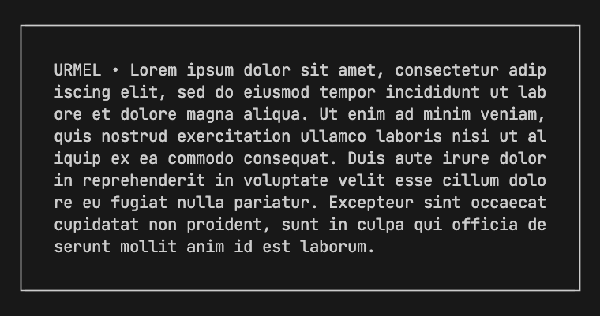

# URMEL - Reactive Terminal Applications

Create interactive, reactive JSX-based UI for any text-based terminal.
Compatible with [UIX](https://uix.unyt.org).

## Getting Started

There is an example app located in the `/example` directory.
You can run it with `deno run -A example/main.tsx`.

For more information, take a look at the [UIX Docs](https://docs.unyt.org/manual/uix/getting-started).