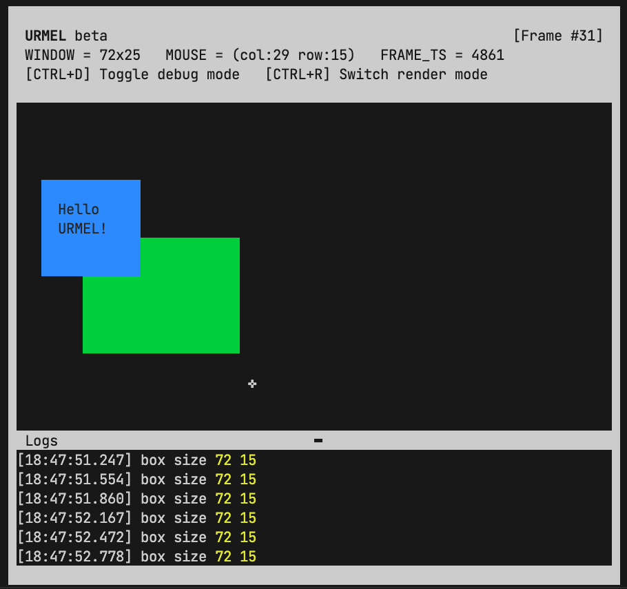

# URMEL - Reactive Terminal Applications

Create interactive, reactive JSX-based UI for any text-based terminal.
Compatible with [UIX](https://uix.unyt.org).



## Getting Started

You can run the examples located in the `/example` directory, e.g.:
```ts
deno run -A example/content-box/exampleBackgroundColor.ts
```

Use `CTRL+D` to toggle debug mode. You can also start the
program with the `--debug` options to enable debug mode per default.

For more information, take a look at the [UIX Docs](https://docs.unyt.org/manual/uix/getting-started).